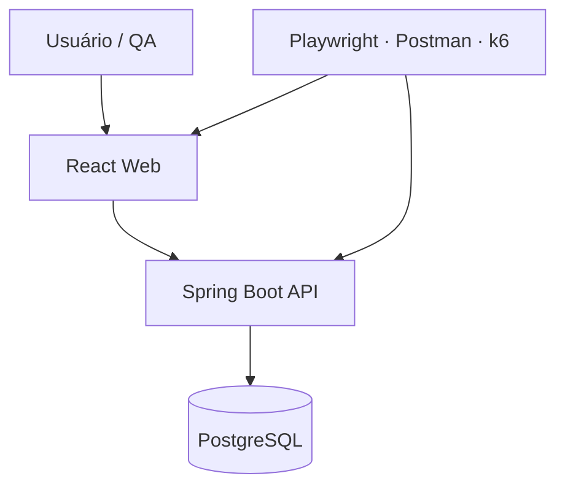

# QA Lab Commerce

Aplicação completa criada para estudar, executar e demonstrar **testes de software em um cenário próximo do mercado**. O projeto simula um e-commerce com autenticação JWT, controle de acesso, catálogo, estoque, pedidos e pagamento aprovado ou recusado.

> Projeto de portfólio de **Jucelio Farias Coelho**, direcionado a oportunidades de QA / Testes de Software Júnior.

## O que você pratica

- Planejamento e execução de testes manuais;
- escrita de cenários positivos, negativos, de limite e segurança;
- testes unitários com JUnit 5, Mockito, Vitest e Testing Library;
- testes de integração com Spring Boot Test, REST Assured e Testcontainers;
- automação de API com Postman e Newman;
- automação web E2E com Playwright em Chromium e Firefox;
- testes de carga e desempenho com k6;
- relatório de cobertura Java com JaCoCo;
- análise passiva de segurança com OWASP ZAP;
- pipeline CI com GitHub Actions;
- evidências e registro profissional de bugs.

## Stack

| Área | Tecnologias |
|---|---|
| Backend | Java 21, Spring Boot 3.5, Spring Security, JWT, JPA |
| Frontend | React, TypeScript, Vite |
| Banco | PostgreSQL 16 e H2 para execução simples |
| Testes Java | JUnit 5, Mockito, REST Assured, Testcontainers, JaCoCo |
| Testes web | Playwright, Vitest, Testing Library |
| API | Postman e Newman |
| Performance | Grafana k6 |
| Segurança | OWASP ZAP Baseline |
| Infraestrutura | Docker Compose e GitHub Actions |

## Arquitetura



## Como executar no Windows

### Opção recomendada — Docker Desktop

Pré-requisitos: Docker Desktop iniciado e Git.

No PowerShell, dentro da pasta do projeto:

```powershell
docker compose up -d --build
docker compose ps
```

Acesse:

- Aplicação: http://localhost:3000
- Swagger/OpenAPI: http://localhost:8080/swagger-ui.html
- Health check: http://localhost:8080/actuator/health

Para encerrar:

```powershell
docker compose down
```

O banco é preservado. Para apagar somente a massa local e recomeçar:

```powershell
docker compose down -v
```

### Usuários de teste

| Perfil | E-mail | Senha |
|---|---|---|
| Cliente | `qa.user@qalab.dev` | `user123` |
| Administrador | `qa.admin@qalab.dev` | `admin123` |

## Como executar os testes

### Backend, integração e JaCoCo

Requer Java 21, Maven e Docker Desktop para os testes com Testcontainers.

```powershell
cd backend
mvn clean verify
start target\site\jacoco\index.html
```

O JaCoCo gera um painel HTML com cobertura por pacote, classe, método, linha e branch. No GitHub Actions, o relatório também é publicado como artefato chamado `jacoco-report`.

### Frontend

```powershell
cd frontend
npm install
npm test
npm run build
```

### Playwright E2E

Com a aplicação iniciada:

```powershell
cd tests\e2e
npm install
npx playwright install
npm test
npm run report
```

### Postman / Newman

Importe os dois arquivos da pasta `tests/postman` no Postman e execute a coleção na ordem. Para executar com Docker:

```powershell
.\scripts\run-api-tests.ps1
```

### k6

```powershell
.\scripts\run-performance-test.ps1
```

Critérios configurados no smoke test:

- taxa de erros abaixo de 1%;
- 95% das requisições abaixo de 500 ms.

## Casos de teste manuais

A planilha CSV `tests/manual/test-cases.csv` contém 20 casos prontos, incluindo:

- login válido, inválido e campos vazios;
- autorização de cliente e administrador;
- SKU duplicado e preço inválido;
- compra sem estoque e produto inexistente;
- pagamento aprovado, recusado, repetido e de outro usuário;
- teste de contrato, segurança e performance.

Use `tests/manual/bug-report-template.md` para registrar defeitos com severidade, prioridade, passos, resultado atual, resultado esperado e evidências.

## Laboratório de bug intencional

O projeto possui uma falha controlada para praticar investigação. No PowerShell:

```powershell
$env:LAB_BUG_ALLOW_NEGATIVE_STOCK="true"
docker compose up -d --build
```

Tente comprar mais unidades do que o estoque (`TC-012`). Registre o defeito, capture request/response e logs. Depois confirme a correção:

```powershell
$env:LAB_BUG_ALLOW_NEGATIVE_STOCK="false"
docker compose up -d --build
```

## Endpoints principais

| Método | Endpoint | Regra |
|---|---|---|
| POST | `/api/auth/login` | Autenticação e emissão de JWT |
| GET | `/api/products` | Catálogo público |
| POST | `/api/products` | Somente administrador |
| POST | `/api/orders` | Cria pedido e valida estoque |
| GET | `/api/orders/mine` | Lista pedidos do usuário autenticado |
| POST | `/api/orders/{id}/payment` | Aprova ou recusa pagamento simulado |

Cartão de aprovação: `4111111111111111`. Cartão de recusa: qualquer número de 16 dígitos terminado em `0`, como `4111111111111110`. São dados fictícios e não são armazenados.

## Estrutura

```text
qa-lab-commerce/
├── backend/                 # API e testes Java
├── frontend/                # interface e testes de componente
├── tests/
│   ├── e2e/                 # Playwright
│   ├── manual/              # estratégia, casos e bugs
│   ├── performance/         # k6
│   └── postman/             # coleção e ambiente
├── scripts/                 # comandos PowerShell
├── .github/workflows/       # CI e segurança
└── docker-compose.yml
```

## Roteiro de estudo sugerido

1. Execute os 20 casos manuais e registre as evidências.
2. Explore a API no Swagger e monte requests no Postman.
3. Rode a coleção Newman e provoque falhas nas asserções.
4. Leia e altere os testes JUnit, Mockito e Vitest.
5. Automatize uma nova jornada com Playwright.
6. Ative o bug intencional, reporte e valide sua correção.
7. Rode o k6, compare p95 e taxa de erro.
8. Publique no GitHub e mostre os relatórios do pipeline.

## Como apresentar no currículo

> **QA Lab Commerce — Plataforma de Testes de Software:** desenvolvimento de ambiente full stack para testes manuais e automatizados de API, interface, integração, segurança e performance, utilizando JUnit 5, Mockito, REST Assured, Testcontainers, JaCoCo, Postman/Newman, Playwright, k6, OWASP ZAP, Docker e GitHub Actions.

## Licença

MIT — uso livre para estudo e portfólio.
